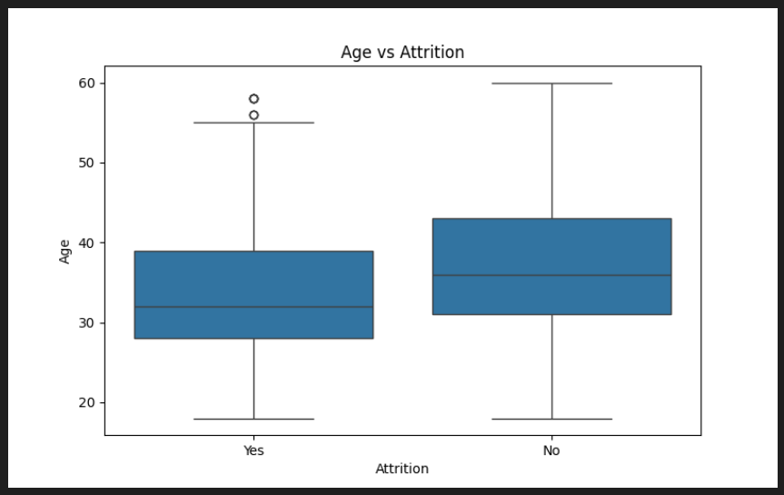
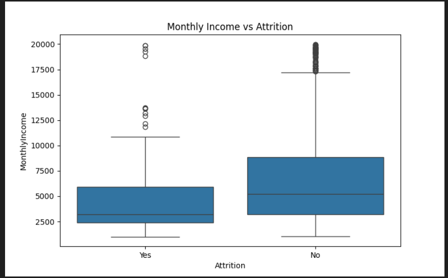
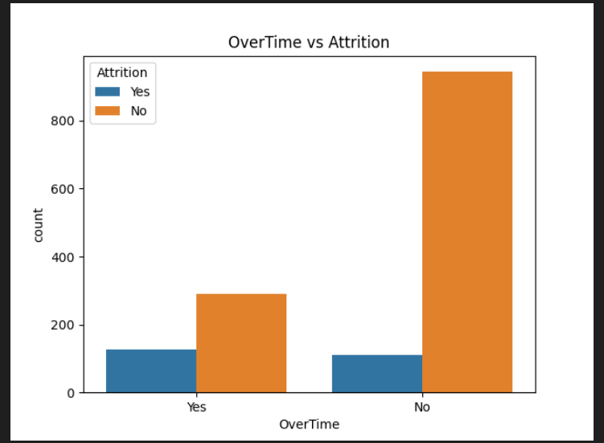
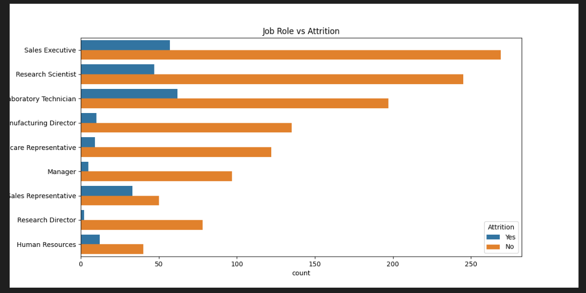
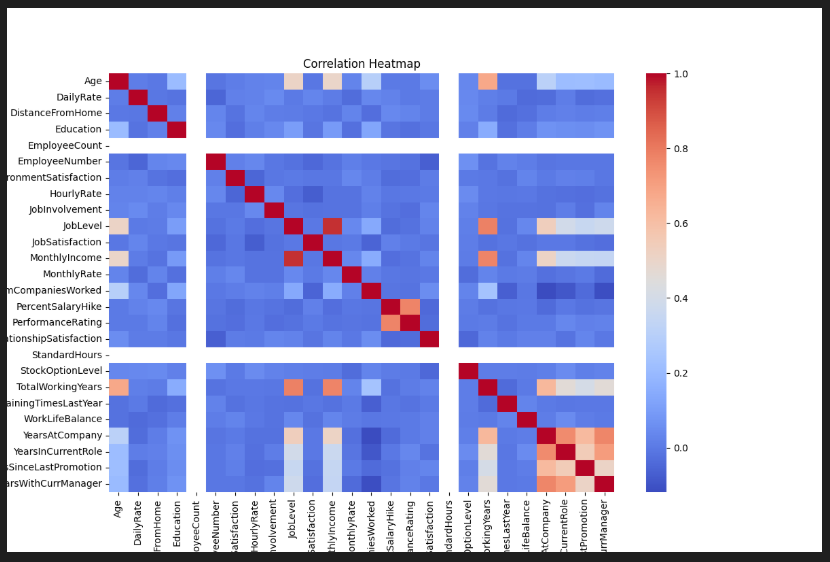

# HR Attrition Analysis using Python
- [Overview](https://github.com/Jk1201-web/HR-Attrition-Analysis#project-overview)
- [Tools used](https://github.com/Jk1201-web/HR-Attrition-Analysis#tools-used)
- [Dataset](https://github.com/Jk1201-web/HR-Attrition-Analysis#dataset)
- [Project workflow](https://github.com/Jk1201-web/HR-Attrition-Analysis#project-workflow)
- [Visualization](https://github.com/Jk1201-web/HR-Attrition-Analysis#key-insights)
   - [Age Vs Attrition](https://github.com/Jk1201-web/HR-Attrition-Analysis#age-vs-attrition)
   - [Monthly income Vs Attrition](https://github.com/Jk1201-web/HR-Attrition-Analysis#monthly-income-vs-attrition)
   - [Overtime Vs Attrition](https://github.com/Jk1201-web/HR-Attrition-Analysis#overtime-vs-attrition)
   - [Jobrole Vs Attrition](https://github.com/Jk1201-web/HR-Attrition-Analysis#job-role-vs-attrition)
   - [Correlation Heatmap](https://github.com/Jk1201-web/HR-Attrition-Analysis#correlation-heatmap)
- [Project structure](https://github.com/Jk1201-web/HR-Attrition-Analysis#project-structure)
- [Conclusion](https://github.com/Jk1201-web/HR-Attrition-Analysis#conclusion)
- [Connect with me](https://github.com/Jk1201-web/HR-Attrition-Analysis/blob/main/README.md#connect-with-me)
   - [LinkedIn](www.linkedin.com/in/jijau-khandale)
   - [GitHub](https://github.com/Jk1201-web)
   - [Kaggle](https://www.kaggle.com/jijaumohankhandale) 
## Project Overview
Employee attrition is a major challenge for organizations.
This project performs Exploratory Data Analysis (EDA) on an HR dataset to identify patterns and key factors influencing employee turnover.
### The objective of this project is to:
  - Understand employee attrition patterns
  - Identify factors contributing to attrition
  - Provide business insights using data visualization

## Tools Used:
- Python
- Pandas
- Matplotlib
- Seaborn
- VS Code

## Dataset:
The dataset contains 1470 employee records and includes features such as:
- Age
- Daily Rate
- Monthly Income
- Job Role
- OverTime
- Years at Company
- Job Level etc...,

## Project Workflow:
- 1 Data Loading and Inspection
- 2 Checking Missing Values
- 3 Data Cleaning
- 4 Exploratory Data Analysis (EDA)
- 5 Data Visualization
- 6 Generating Business Insights

## Key Insights:
- The overall attrition rate is approximately 16%, indicating moderate employee turnover.
- Employees working overtime show significantly higher attrition.
- Employees with lower monthly income are more likely to leave.
- Younger employees have higher attrition compared to senior employees.
- Operational roles show higher attrition than managerial roles.

## Visualizations:
#### Age vs Attrition

- The plot shows that younger employees have a higher attrition rate compared to older employees. This suggests early-career employees are more likely to leave the organization.

#### Monthly Income vs Attrition

- Employees with lower monthly income show higher attrition compared to higher-paid employees, indicating compensation may be a key factor influencing employee turnover.

#### OverTime vs Attrition

- Employees who work overtime have significantly higher attrition than those who do not. This suggests workload and work-life balance are important factors affecting employee retention.

#### Job Role vs Attrition

- Some operational roles show higher attrition compared to managerial positions, indicating that job role and responsibilities may influence employee turnover.

#### Correlation Heatmap

- The heatmap shows relationships between numerical variables. Strong correlations are observed between tenure-related features, indicating patterns in employee experience and career progression.

## Project Structure: 

HR-Attrition-Analysis
│
├── HR_Attrition.py
├── HR_Attrition.csv
├── insights.txt
├── attrition_plot.png
├── age_vs_attrition.png
├── monthlyincome_vs_attrition.png
├── overtime_vs_attrition.png
├── jobrole_vs_attrition.png
├── correlation_heatmap.png

## Conclusion:
The analysis indicates that overtime workload, compensation level, and employee experience are major factors influencing attrition.
Organizations can reduce attrition by improving work-life balance, employee engagement, and compensation strategies.

## Connect with me
- [LinkedIn](www.linkedin.com/in/jijau-khandale)
- [GitHub](https://github.com/Jk1201-web)
- [Kaggle](https://www.kaggle.com/jijaumohankhandale)

